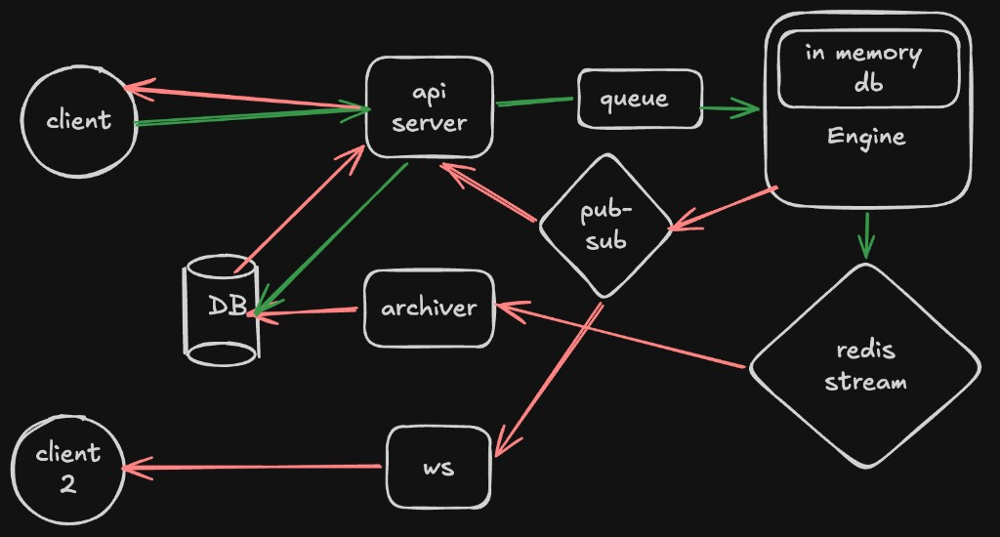

# Probo Turbo

Opinion-market exchange monorepo: API, matching engine, WebSocket fan-out, archiver, and Vite web app.

## Architecture



| Piece | Role |
| --- | --- |
| **api-server** | Auth + HTTP API; enqueues engine work |
| **engine** | In-memory orderbook / balances; publishes results |
| **ws** | Live market updates to clients (Redis pub/sub) |
| **archiver** | Consumes Redis stream → Postgres |
| **web** | React (Vite) frontend |

## Apps

```
apps/api-server   HTTP API + Better Auth
apps/engine       Matching engine
apps/ws           WebSocket server
apps/archiver     Persistence worker
apps/web          Frontend
```

## Quick start

**1. Env**

```bash
cp .env.example .env          # fill DATABASE_URL, REDIS_URL, auth, etc.
cp apps/web/.env.example apps/web/.env
```

**2. Backend (Docker)**

```bash
docker compose up -d --build
```

- API: `http://localhost:3000`
- WS: `ws://localhost:8080`
- Caddy (optional): `http://localhost`

**3. Frontend (local)**

```bash
pnpm install
pnpm --filter web dev
```

`apps/web/.env`:

```
VITE_BACKEND_BASE_URL=http://localhost:3000
VITE_WS_URL=ws://localhost:8080
```

## Notes

- Postgres + Redis are external (`DATABASE_URL`, `REDIS_URL` in `.env`).
- Never commit `.env` files — use `.env.example` as the template.
